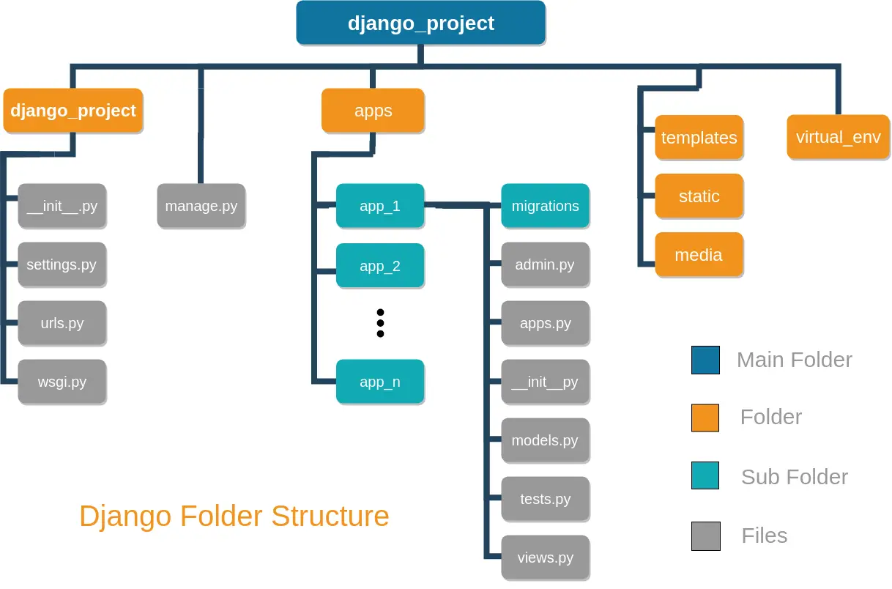

# Django Project Template

## Getting started

- Install [poetry](https://python-poetry.org/docs/#installation)
- Install [watchman](https://facebook.github.io/watchman/docs/install.html) - this is used to watch for file changes for more efficient reloading of the server (https://adamj.eu/tech/2021/01/20/efficient-reloading-in-djangos-runserver-with-watchman/)
- Start project django project with `django-admin startproject --template=/Users/william.hayes/code/django_templates/project_tmpl --extension=py,md,example,gitignore,toml CHANGEME_PROJECT_NAME`
- Create app with by into `apps` directory next to manage.py and run `django-admin startapp --template=/Users/william.hayes/code/django_templates/app_core_tmpl/app_name --extension=py,md,example,gitignore,toml CHANGEME_APP_NAME`
- Add app to `INSTALLED_APPS` in `settings.py` as 'apps.CHANGEME_APP_NAME'
- Update project `.env` file with correct values for settings.py
- Run poetry install `poetry install`
- Run pre-commit install `pre-commit install`
- Run pre-commit autoupdate `pre-commit autoupdate`
- Run pre-commit run --all-files `pre-commit run --all-files`
- Run django makemigrations `./manage.py makemigrations`
- Run django collectstatic `./manage.py collectstatic`
- Run django migrations `./manage.py migrate`
- Run django createsuperuser `./manage.py createsuperuser`
- Run django runserver `./manage.py runserver`

## Django project structure

See [Figure 1](#figure_1) below for a diagram of the project structure.

Use the command ([cli options](https://docs.djangoproject.com/en/4.1/ref/django-admin/#startproject)) to deploy project and app templates into your django application:
- `django-admin startproject --template=/Users/william.hayes/code/django_template/project_template --extension=py,md,example,gitignore,toml CHANGEME_PROJECT_NAME`
- `django-admin startapp --template=/Users/william.hayes/code/django_template/apps/app_template --extension=py,md,example,gitignore,toml CHANGEME_APP_NAME`

## Useful commands

  - `./manage.py graph_models -a -g -o my_project_visualized.png` - this will generate a diagram of the models in your project - requires [django-extensions](https://django-extensions.readthedocs.io/en/latest/graph_models.html) and pygraphviz to be installed
    - May need to manually install pygraphviz using pip instead of poetry in order to add locations of graphviz lib and include directory when building the package extensions `pip install --global-option=build_ext --global-option="-L/opt/homebrew/Cellar/graphviz/7.1.0/lib/" --global-option="-I/opt/homebrew/Cellar/graphviz/7.1.0/include/" pygraphviz`

## Must have Django packages

- [django-debug-toolbar](https://django-debug-toolbar.readthedocs.io/en/latest/) - this will show you a toolbar on the side of the page with useful information
- [django-watchfiles](https://pypi.org/project/django-watchfiles/) - this will watch for file changes and reload the server, the pywatchman package doesn't work with python 3.10 so this is a good alternative
- [django-browser-reload](https://github.com/adamchainz/django-browser-reload) - this will reload the browser when you change a template file
- [django-extensions](https://django-extensions.readthedocs.io/en/latest/index.html) - provides runserver_plus (allows for local https) and other useful management commands
- [Django Crispy Forms](https://django-crispy-forms.readthedocs.io/en/latest/index.html) - allows you to easily style forms

## Nice to have Django packages

- django-widget-tweaks - this will allow you to add classes to form fields
- Django Ninja - FastAPI-like Rest Framework for Django
- Django Import Export - Allows you to import/export data via Excel, CSV, JSON, YAML via the Admin interface
- Django Tenants
- Django Filter - simplifies filtering models via Forms and the Django Rest Framework (what about Ninja?)
- Django Allauth - used for local and social authentication
- Django GUID - supports matching log messages with the HTTP request - adds a Trace ID to all HTTP-related logs
- Celery/Celery Beat - background processing, Beat provides periodic tasks scheduler for Celery
- [Django Baton](https://django-baton.readthedocs.io/en/latest/) - Admin Web Interface enhancer - A cool, modern and responsive django admin application based on bootstrap 5
- [Django Cookie Cutter](https://cookiecutter-django.readthedocs.io/en/latest/index.html)
- [Django Queue](https://django-queue.readthedocs.io/en/latest/) - A simple queueing system for Django
- [Django Upgrade Tool](https://github.com/adamchainz/django-upgrade)
- [Simple History](https://github.com/jazzband/django-simple-history) - Capture model changes
- [Dialog Form](https://github.com/zoltan-ky/django-dialogform) - Django tooling to support Dialogs and Modals
- [Oso](https://docs.osohq.com/reference/frameworks/django.html) - Oso Django Authorization library
- [Templated Emails](https://github.com/vintasoftware/django-templated-email)
- [Safe Delete](https://django-safedelete.readthedocs.io/en/latest/admin.html#module-safedelete.admin) - Easy soft deletes
- [Notifications](https://github.com/django-notifications/django-notifications) - GitHub notifications alike app for Django
- [Autocompletes](https://django-autocomplete-light.readthedocs.io/en/master/tutorial.html)
- [Tables2](https://github.com/jieter/django-tables2) - Tables creation support for Django
- [Stripe](https://dj-stripe.github.io/dj-stripe/2.7/project/contributing/) - Stripe payment gateway support
- [Admin Envs](https://github.com/dizballanze/django-admin-env-notice) - ADD TO TEMPLATE!!!

## Third party packages

- alpine.js - this is a javascript framework that allows you to add interactivity to your site without writing javascript or using jQuery
- htmx - htmx gives you access to AJAX, CSS Transitions, WebSockets and Server Sent Events directly in HTML, using attributes, so you can build modern user interfaces with the simplicity and power of hypertext
- tailwindcss - this is a utility first CSS framework
- Bootstrap5 (used by Django Baton)
- MDBootstrap
- Sentry/Datadog

# Notes

- You can create some data and then run `python manage.py dumpdata > data.json` to create a fixture file. You can then load this data into a new database with `python manage.py loaddata data.json`
- You can create a superuser with `python manage.py createsuperuser`
- You can run the tests with `python manage.py test`
- You can run the server with `python manage.py runserver`
- [Page transitions](https://www.silvestar.codes/articles/transition-between-pages-smoothly-with-a-single-line-of-code/)
- [TailScan](https://tailscan.com/)
- [Tailwind Cheat Sheet](https://nerdcave.com/tailwind-cheat-sheet)
- [Sidewinder - Django project template](https://github.com/stribny/sidewinder)
- 
## Django HTMX/Alpine/Tailwind Notes

What is the best package below for supporting re-usable components in Django or supporting HTMX functionality?

- [Django Render Block](https://github.com/clokep/django-render-block) - allows you to render a named block from a template in a HTMX call 
- [Django Template Partials](https://github.com/carltongibson/django-template-partials) - Reusable named inline partials for the Django Template Language.
- [Django Slippers](https://mitchel.me/slippers/) - Slippers includes a number of extra template tags and filters to help template authors build reusable components.

## Tutorials and examples

- Soft deletion
  - https://adriennedomingus.medium.com/soft-deletion-in-django-e4882581c340
  - https://medium.com/@amrullah.zunzunia/a-simple-implementation-for-django-model-soft-delete-2473477029d
  - https://medium.com/@tomisinabiodun/implementing-soft-delete-in-django-an-intuitive-guide-5c0f95da7f0d
- Periodic tasks using Celery Beat
  - https://medium.com/@jasonrigden/periodic-tasks-with-celery-beat-4e2e1f8f8c7e
- Best practices - https://django-best-practices.readthedocs.io/en/latest/projects.html
- Reset Django DB - https://mattsegal.dev/reset-django-local-database.html
- Automate Postgres backups - https://mattsegal.dev/postgres-backup-automate.html
- Load CSV data into Django - https://towardsdatascience.com/use-python-scripts-to-insert-csv-data-into-django-databases-72eee7c6a433
- Create and Load test data - https://mattsegal.dev/django-factoryboy-dummy-data.html
- Setup pytest with Django and Github Actions - https://mattsegal.dev/setup-pytest-django-github-actions.html
- Backup and restore Postgres DB - https://mattsegal.dev/postgres-backup-restore.html
- Debugging Django - https://mattsegal.dev/django-debug-pdb.html

## Setup new project

See NEW_PROJECT.md file

Using startproject and startapp with templates

- Bugbytes video on this: https://www.youtube.com/watch?v=_s6g6yP0ahY

    django-admin.py startproject --template=https://github.com/lincolnloop/django-layout/tarball/master -e py,rst,example,gitignore my_project_name

## Example projects

- Great examples here - this one of several dozen is focused on using Django, HTMX, Alpine and Tailwind together and has lot of neat tips: https://github.com/katanaml/sample-apps/tree/master/20/django-htmx-sandbox
- Django Registration System for DCCN conference - https://github.com/dccnconf/dccnsys

## <a name="figure_1">Figure 1 - Django project structure</a>

$$

$$